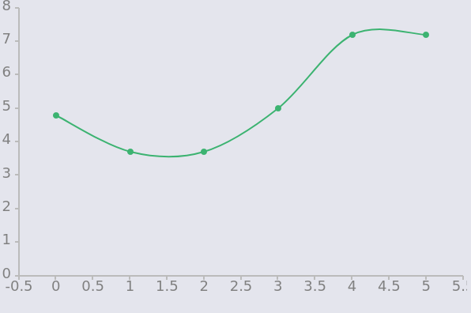

Отчет

Есть программа-генератор generate\_data.c. Она создает матрицы a и b и заполняет их случайными целыми числами.
Есть также программа main.c. Она принимает на вход параметры в соответствии с условием задачи и перемножает матрицы a и b.
Есть скрипт test.sh,проверяющий корректность умножения матриц во всех случаях.

Результаты:
График, приведенный ниже иллюстрирует влияние кэша на производительность программы. По вертикальной оси - время исполнения программы в секундах,
по горизонтальной - целые числа от 0 до 5 - режимы, в которых запускается программа.

