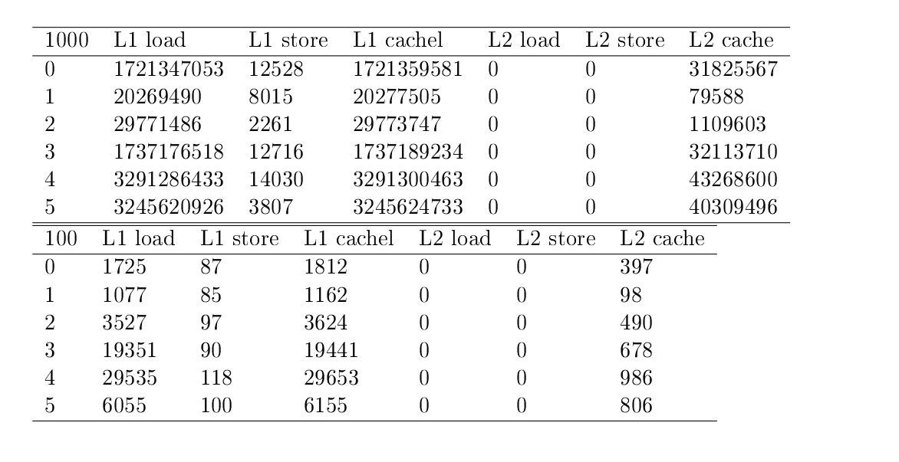

Отчет

Есть программа-генератор generate\_data.c. Она создает матрицы a и b и заполняет их случайными целыми числами.
Есть также программа main.c. Она принимает на вход параметры в соответствии с условием задачи и перемножает матрицы a и b.
Есть скрипт test.sh,проверяющий корректность умножения матриц во всех случаях.

Результаты:
График, приведенный ниже иллюстрирует влияние кэша на производительность программы. По вертикальной оси - время исполнения программы в секундах,
по горизонтальной - целые числа от 0 до 5 - режимы, в которых запускается программа.

Действительно, кэш влияет на производительность программы - наименее эффективны режимы 4 и 5 (время исполнения 7,2 секунды).
Средней эффективности режимы 3 и 0 (время 4.8 секунды). И самые эффективные режимы - 1 и 2 (3,7 секунды).

Разница во времени происходит из-за того, что в разных реализациях умножения матриц мы по-разному обращаемся к памяти. Соответственно, данные помещаются в кэш по-разному и следовательно, кэширование - единственная причина разницы в производительности.

Отчет по problem2:

